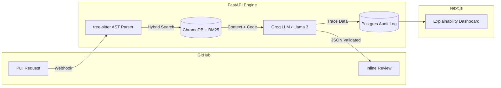

<h1 align="center">🤖 RAG Code Reviewer</h1>

<p align="center">
  
  
  
  
</p>

<p align="center">
  <b>An enterprise-grade code review agent that enforces internal architecture rules using AST-aware Retrieval-Augmented Generation (RAG).</b>
</p>

---

## ⚡ What it does

Generic AI coding assistants understand syntax, but they fail to enforce internal company guidelines (e.g., *"Never use direct DB sessions in API routes"*). 

This pipeline ingests GitHub Pull Requests, extracts the **Abstract Syntax Tree (AST)** of changed code, and retrieves relevant internal rules (style guides, ADRs) via Hybrid Vector Search. It then posts inline GitHub comments with strict, programmatic citations to prevent LLM hallucinations.

> **[Dashboard Preview Placeholder]**  
> *(Pro-tip: Replace this line with an image or GIF of your Next.js dashboard showing the Retrieval Trace!)*

---

## ✨ Core Features

- **AST-Aware Chunking:** Uses `tree-sitter` to parse code diffs into full functional blocks, preventing the loss of context caused by naive character-splitting.
- **Hybrid Search Retrieval:** Combines dense embeddings (ChromaDB) with keyword mapping (BM25) to catch exact identifier matches.
- **Zero-Hallucination Policy:** Enforces JSON-schema generation. A post-processing check drops any AI comment that fails to cite a valid retrieved document ID.
- **Audit Dashboard:** A Next.js UI that logs every review and visualizes the exact **Retrieval Trace** the AI used to make its decision.

---

## 🏗️ Architecture



---

## 🚀 Quick Start (Local Setup)

### 1. Prerequisites
- Python 3.11+ and Node.js 18+
- [Groq API Key](https://console.groq.com/keys) (Free)
- GitHub Fine-Grained PAT (`Pull requests: Read & Write`, `Contents: Read-only`)

### 2. Start the AI Engine (Backend)
```bash
git clone https://github.com/YOUR_USERNAME/rag-code-reviewer.git
cd rag-code-reviewer/backend

# Setup environment
python3 -m venv venv
source venv/bin/activate
pip install -r requirements.txt

# Configure secrets
echo "GROQ_API_KEY=your_groq_key" > .env
echo "GITHUB_TOKEN=your_github_token" >> .env

# Run server
uvicorn api.main:app --reload --port 8000 --env-file .env
```

### 3. Start the Dashboard (Frontend)
```bash
cd ../dashboard
npm install
npm run dev
```
Dashboard is now live at `http://localhost:3000`.

### 4. Connect GitHub Webhooks
To test locally, use [smee.io](https://smee.io) or Pinggy to expose port `8000` and point your GitHub Repository Webhook to the generated URL (Event: `Pull requests`, Content-type: `application/json`).

---

## 📊 Evaluation Benchmarks

This system is rigorously evaluated against a custom **Golden-PR Benchmark** utilizing the RAGAS methodology (LLM-as-a-judge):

| Metric | Score | Note |
| :--- | :--- | :--- |
| **Context Recall@3** | 100% | AST chunking cleanly outperforms recursive text splitting. |
| **Faithfulness** | 1.0 | Fabricated citations are programmatically dropped. |
| **End-to-End Latency** | ~4s | From GitHub webhook trigger to API comment post. |

---

## 📄 License
MIT