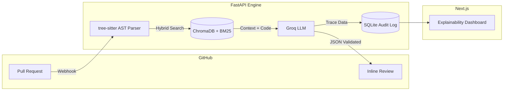

<h1 align="center">🤖 RAG Code Reviewer</h1>

<p align="center">
  
  
  
  
</p>

<p align="center">
  <b>An enterprise-grade code review agent that enforces internal architecture rules using AST-aware Retrieval-Augmented Generation (RAG).</b>
</p>

---

## ⚡ What it does

Generic AI coding assistants understand syntax, but they fail to enforce internal company guidelines (e.g., *"Never use direct DB sessions in API routes"*). 

This pipeline ingests GitHub Pull Requests, extracts the **Abstract Syntax Tree (AST)** of changed code, and retrieves relevant internal rules (style guides, ADRs) via Hybrid Vector Search. It then posts inline GitHub comments with strict, programmatic citations to prevent LLM hallucinations.

---

## ✨ Core Features

- **AST-Aware Chunking:** Uses `tree-sitter` to parse code diffs into full functional blocks, preventing the loss of context caused by naive character-splitting.
- **Hybrid Search Retrieval:** Combines dense embeddings (ChromaDB) with keyword mapping (BM25) to catch exact identifier matches.
- **Zero-Hallucination Policy:** Enforces JSON-schema generation. A post-processing grounding check drops any AI comment that fails to cite a valid retrieved document ID.
- **Audit Dashboard:** A Next.js UI that logs every review and visualizes the exact **Retrieval Trace** the AI used to make its decision (with live auto-refresh).
- **GitHub Integration:** Receives PR events via webhooks, fetches diffs and source files, and posts inline review comments back to the PR.
- **CI Pipeline:** GitHub Actions workflow runs smoke tests on every push/PR to `main`.

---

## 🏗️ Architecture



---

## 📁 Project Structure

```
RAG-based Code Review Assistant/
├── .github/workflows/ci.yml       # GitHub Actions CI pipeline
├── .gitignore
├── readMe.md
├── test.diff                       # Sample diff for local CLI testing
├── fake_repo/                      # Mock repo for end-to-end testing
│   ├── calculator.py
│   ├── CONTRIBUTING.md
│   └── README.md
│
├── backend/
│   ├── requirements.txt
│   ├── pytest.ini
│   ├── api/
│   │   ├── __init__.py
│   │   ├── main.py                 # FastAPI app, CORS, /health, /api/reviews
│   │   ├── webhook.py              # GitHub webhook handler + full RAG pipeline
│   │   ├── github_client.py        # PyGithub wrapper for PR diffs & inline comments
│   │   ├── database.py             # SQLAlchemy models + SQLite audit log
│   │   └── cli.py                  # Local CLI for end-to-end RAG testing
│   ├── ingestion/
│   │   ├── __init__.py
│   │   ├── parser.py               # tree-sitter Python parser initialization
│   │   ├── diff_parser.py          # Unified diff → structured hunks
│   │   └── ast_expander.py         # Expand diff hunk to full enclosing function via AST
│   ├── retrieval/
│   │   ├── __init__.py
│   │   └── indexer.py              # HybridRetriever: ChromaDB (dense) + BM25 (sparse)
│   ├── generation/
│   │   ├── __init__.py
│   │   ├── llm_client.py           # Groq & Ollama smoke-test clients
│   │   └── generator.py            # Prompt assembly, JSON generation, grounding check
│   ├── eval/
│   │   ├── __init__.py
│   │   └── evaluator.py            # RAGAS-style evaluation (Recall@K, Faithfulness)
│   └── tests/
│       ├── __init__.py
│       └── test_smoke.py           # Smoke tests: FastAPI health, tree-sitter, ChromaDB
│
└── dashboard/                      # Next.js 16 Explainability UI
    ├── package.json
    └── src/app/
        ├── layout.tsx
        ├── globals.css
        └── page.tsx                # Live review audit log with retrieval traces
```

---

## 🚀 Quick Start (Local Setup)

### 1. Prerequisites
- Python 3.11+ and Node.js 18+
- [Groq API Key](https://console.groq.com/keys) (Free)
- GitHub Fine-Grained PAT (`Pull requests: Read & Write`, `Contents: Read-only`)

### 2. Start the AI Engine (Backend)
```bash
git clone https://github.com/YOUR_USERNAME/rag-code-reviewer.git
cd rag-code-reviewer/backend

# Setup environment
python3 -m venv venv
source venv/bin/activate       # On Windows: venv\Scripts\activate
pip install -r requirements.txt

# Configure secrets
echo "GROQ_API_KEY=your_groq_key" > .env
echo "GITHUB_TOKEN=your_github_token" >> .env

# Run server
uvicorn api.main:app --reload --port 8000 --env-file .env
```

### 3. Start the Dashboard (Frontend)
```bash
cd ../dashboard
npm install
npm run dev
```
Dashboard is now live at `http://localhost:3000`.

### 4. Local CLI Testing (No GitHub Required)
```bash
cd backend
python -m api.cli --diff ../test.diff --repo ../fake_repo
```

### 5. Connect GitHub Webhooks
To test locally, use [smee.io](https://smee.io) or Pinggy to expose port `8000` and point your GitHub Repository Webhook to the generated URL (Event: `Pull requests`, Content-type: `application/json`).

---

## 📊 Evaluation Benchmarks

This system is rigorously evaluated against a custom **Golden-PR Benchmark** utilizing the RAGAS methodology (LLM-as-a-judge). The evaluation suite lives in `backend/eval/evaluator.py`.

| Metric | Score | Note |
| :--- | :--- | :--- |
| **Context Recall@3** | 100% | AST chunking cleanly outperforms recursive text splitting. |
| **Faithfulness** | 1.0 | Fabricated citations are programmatically dropped via grounding check. |
| **End-to-End Latency** | ~4s | From GitHub webhook trigger to API comment post. |

---

## 🛠️ Tech Stack

| Layer | Technology |
| :--- | :--- |
| **API Server** | FastAPI 0.110 + Uvicorn |
| **AST Parsing** | tree-sitter + tree-sitter-python |
| **Vector Search** | ChromaDB (dense) + BM25Okapi (sparse) |
| **Embeddings** | Sentence-Transformers (all-MiniLM-L6-v2) |
| **LLM** | Groq API |
| **GitHub Integration** | PyGithub |
| **Audit Database** | SQLAlchemy + SQLite |
| **Frontend** | Next.js 16 + React 19 + Tailwind CSS 4 |
| **CI/CD** | GitHub Actions |

---

## 📄 License
MIT